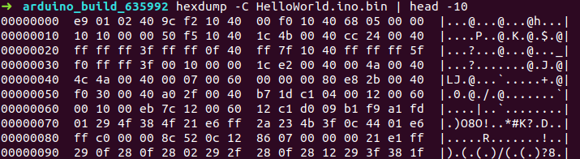
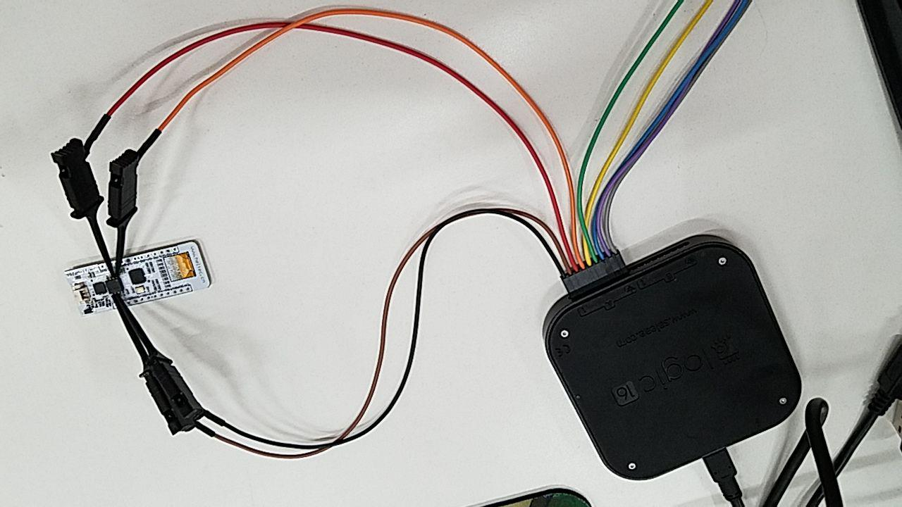
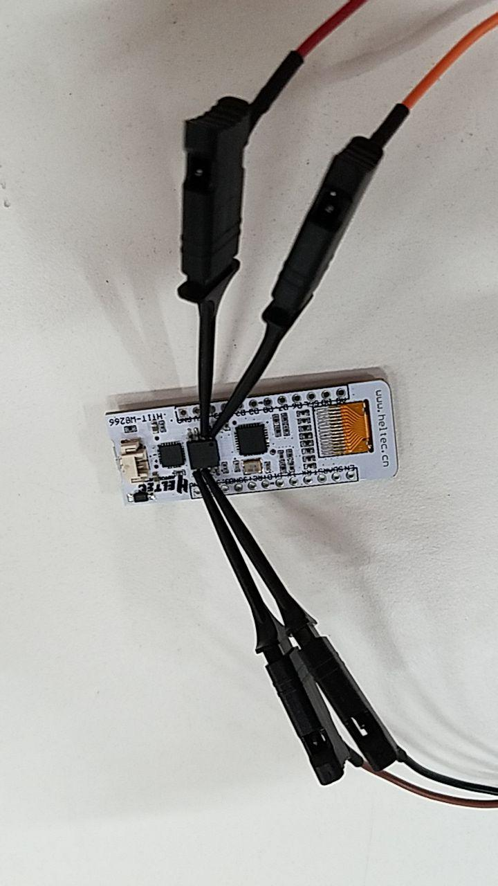
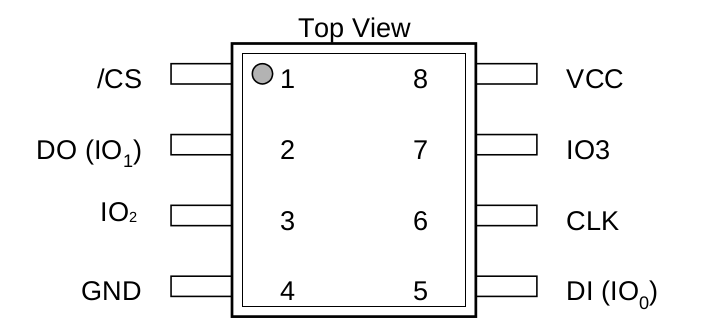

# Catching the firmware

We are hackers, and we want to learn how easily could be make reverse enginerring over an esp8266.

First, we could catch the firmware that would be uploaded to the device just reading the log window

when we read the first bytes of the file, we get:

## que tiene el dispositivito este

un procesador esp8266ex, una flash de 4mb winbond donde storea el programa y un conversor ttl serial cp2102

## Connecting the logic analizer

with the logic analyzer we could read lalalaa

con zoom

para conectarlo nos basamos en el datasheet

